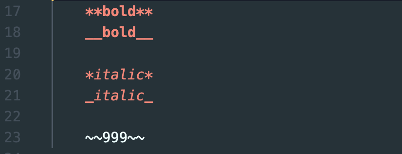
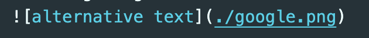
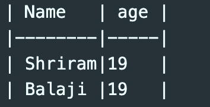

# Introduction to markdown 

1. ## Creating Heading  

    # Heading 1  
    ## Heading 2
    ### Heading 3
    #### Heading 4
    code👇🏻
    
    We use '#' to indicate that it is a header.

    > **NOTE:** the space after `#` which is important

2. ## Text manipulation

    **bold** 
    __bold__

    *italic*
    _italic_

    ~~999~~

     code👇🏻
     
    

    Here for bold and italics we can make use of either '`**`' or '`__`' anything is fine.

    For strike through we enclose the text with '`~~`'

    >__NOTE:__ you should leave a 1 line gap to get paragraph 

    Quoting
    > make use of > symbol for quoting

    
    ***

    > to get a line  like above use *** or ___

3. ## Lists
    1. ### Ordered lists
    
        1. line one 
        2. line two
        2. line three 
            1. nested line one
            2. nested line two
        2. line four

        code👇🏻
        
        
        
        
        
        Just by using '`1. `' you can get a ordered list, to get nested ordered  list provide a tab space in the list as shown.
        > NOTE: Here, I used 2. three times but the list in the preview comes out to be correct order
        
        > Do not forget to give space after 1. 


    2. ### unordered list
    
    
        - list 
            - nested
            - nested
        - list
        - list

        code👇🏻
        
        

        same as ordered list just replace '`1. `' with '`- `'

    


4. Inline links

    [google](https://www.google.com/)
  
    code👇🏻
    
    
    
    
    A simple inline link to a webpage is shown above, as you can see the syntax goes like this text to be shown goes inside square brackets i.e '`[]`' and the link to the webpage goes inside curley braces '`()`'.

    [hower to get text](https://www.google.com/ "this text will appear when hower over inline text")

    code👇🏻
    
    
    Here adding a extra text bounded in " " in curley braces itself will add this feature.

5. Inserting code snippets

    ```java
    proper code 
    system.out.println("hello people");
    ``` 
    
    code👇🏻
    
    

    you can able to insert a code snippet using "/```", to specify which language cod you are inserted, you can do that as I did in first line

    *Another example*

    ```javascript
    console.log("hello");
    ```
     
     code👇🏻
     
    

6. Inserting images

    
    
     code👇🏻
     
    

    Here you just need to follow the same syntax of link and add "`!`" in front of square bracket.
7. Table
    | Name   | age | 
    |--------|-----|
    | Shriram|19   |
    | Balaji |19   |
    
    
    code👇🏻
    
    
    There must be at least 3 to 4 - to separate each header cell.


